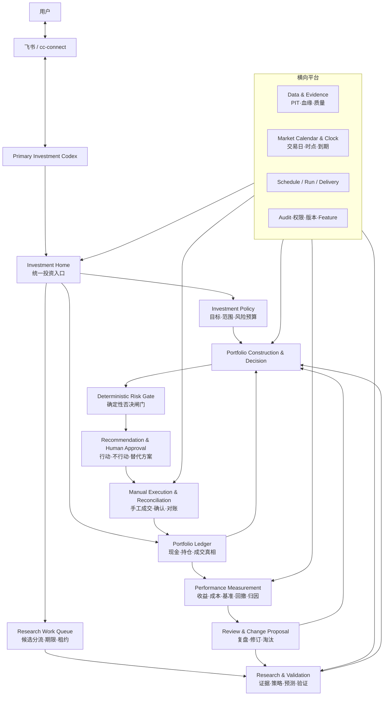

# Investment Companion：版本无关目标架构

状态：架构重构基线
日期：2026-08-23

## 1. 产品使命

Investment Companion 是一个由 Primary Investment Codex 驱动、通过 cc-connect 与飞书服务单一用户的个人投资管理系统。它的直接目标是：

> 持续发现和验证投资机会，结合用户真实组合形成可执行建议，并用真实盈亏淘汰无效方法，帮助用户在中国境内合法投资品中改善投资结果。

架构本身不制造收益，但必须让数据、研究、预测、组合判断、风险、执行和结果反馈形成一条可以反复检验的生产链，而不是一组彼此孤立的功能。

## 2. 系统边界

- Primary Investment Codex 是唯一语义判断、研究编排、正式建议和用户沟通主体。
- cc-connect 与飞书是通信通道，不是事实库；本次架构升级不替换它们。
- 用户始终手工交易。系统不持有券商凭据，不连接券商下单，也不把建议写成成交。
- SQLite、不可变文件和内容寻址对象保存精确事实；聊天历史和 Markdown current 视图不是权威事实。
- 硬约束、金额、收益、成本、时间、状态转换和对账使用确定性代码；LLM 只解释结果和处理语义判断。

## 3. 总体架构



## 4. 五层职责

| 层 | 负责 | 不负责 |
|---|---|---|
| 交互层 | 飞书、cc-connect、Codex 会话、用户可读结果 | 投资事实和业务规则 |
| 应用层 | `investment_home`、上下文装配、用例编排、命令边界 | 自己计算收益或绕过领域规则 |
| 投资领域层 | Policy、Ledger、Research、Decision、Risk、Execution、Performance、Review | 调度器、网络和数据库细节 |
| 平台层 | 市场日历、任务运行、交付、审计、权限、版本和内容寻址 | 最终投资判断 |
| 基础设施层 | SQLite、Tushare、文件存储、systemd、cc-connect 适配 | 向上泄漏供应商数据结构 |

依赖只能从外向内：接口和基础设施依赖应用契约，应用依赖领域，领域不得反向依赖 MCP、飞书、systemd 或某个数据供应商。

## 5. 专业投资主链路

### 5.1 Policy 与 Ledger 分离

Investment Policy 保存目标、基准、投资范围、风险预算、时间跨度和停止条件。Portfolio Ledger 只保存经用户确认的现金、持仓和成交事实。成交可以改变 Ledger，不能修改 Policy；人生约束变化必须产生新的确认版本。

### 5.2 Research 与 Validation 分离

Research 可以提出证据、Thesis、策略和预测。Validation 独立检查数据时点、样本外结果、成本、反证和适用范围。研究产物只有通过声明的验证条件后，才能进入组合决策；扫描榜单和未验证预测不能直接创建行动卡。

`ResearchWorkService` 补齐候选发现与完整研究之间的协调断点。每个非空候选批次幂等地产生分流任务，要求逐项进入研究、淘汰或限期观察；租约与到期恢复防止跨会话遗忘。它不保存研究结论，也不能写 Decision、Execution 或 Ledger。未完成任务阻止 `no_action`，逾期任务或最新候选无任务由 Doctor 报错。

`ResearchCatalogService` 是研究读取面的版本无关边界。它把持续扫描、预测候选、信号、前向复核和正式验证映射为稳定 `ResearchRecord`，但不把历史 Pipeline 名称自动注册为 StrategyVersion。未在 Strategy Registry 中真实存在的方法始终标记为 `research_method_only`；展示统一不等于资格升级。

当前统一验证结果使用不可变 Calculation 表达，而不是再增加一个可随意编辑的“研究状态”：

- 定性 Thesis 只有在精确版本、至少两个冻结且声明为独立组的来源、`first_known_at`/`observed_at` 均不晚于知识截止时间、数据未过期、反证搜索、失效条件、适用范围和成本假设全部齐备时，才是 `eligible_for_decision`；这证明证据流程达到决策级，不宣称观点必然正确。
- 当上述完整标准只缺多源独立印证或预测前向验证，但仍有至少一项非预测的冻结证据，且时点、新鲜度、反证、失效条件、适用范围和成本全部合格时，可成为 `eligible_for_bounded_action`。它只能进入由确认 Program 限额的 `conditional_action`，不能升级为正式行动。
- 量化 Strategy 复用唯一的预注册 Experiment 与 Shadow 事实。完整离线计划和最终留出集通过后为 `eligible_for_shadow`；只有不调参的前向 Shadow 样本也达到门槛后，才是 `eligible_for_decision`。
- 任何含 `unvalidated` 预测状态的证据只能保持 `research_only`。Validation 不能创建 Decision、行动卡、Execution、Ledger 或在线修改 Strategy。

### 5.3 Decision 与 Risk 分离

Codex 综合研究、真实组合、不行动和替代方案形成 Decision。Risk Gate 使用确定性规则检查 Mandate、现金、集中度、流动性、数据新鲜度、行动有效期、重复行动和市场执行约束，并拥有否决权。风险闸门不是另一个 LLM Agent。

`ActionabilityService` 是 Decision 与 Action Card 之间的只读证明边界：它要求 Opportunity、Decision 和 Research Validation 引用同一份不可变 Calculation，检查当前 Investor/Mandate、确认账本与 Thesis/Strategy 版本没有漂移，并使用最新行情重新运行 Risk Gate。它可以生成新的审计 Calculation，但不能推进 Opportunity、修改 Queue、创建 Execution 或写入 Ledger。旧 Decision、旧账本或当前风险不再通过时，行动卡立即失效并回到研究/决策流程。

### 5.4 Action Card、Execution 与 Ledger 分离

Action Card 被接受只表示用户选择了建议。`ExecutionLifecycleService` 随后分别记录准备执行、用户报告已下单、待确认成交和成交对账：

```text
Action Card accepted
  → Execution proposed
  → broker order reported / ordered
  → fill reported / Ledger needs_confirmation
  → user confirms Ledger
  → Execution partially_filled / filled / deviated
  → Queue closed
```

报告成交不改变组合；只有确认 Ledger 才改变组合。真实成交超出建议价格、数量或有效期时仍保存真实账本事实，同时把 Execution 标记为 `deviated`，不得为了让建议显得正确而拒绝或改写现实。多次部分成交按确认流水累计对账。

`InvestmentBriefingService` 是 Execution、Ledger、DecisionQueue 与 Reconciliation 之上的只读应用投影。Investment Home 使用当前投影回答“建议之后发生了什么”；日/周/月 Brief 则自动冻结 `execution_operating_snapshot` Calculation，并把 Calculation ID 加入来源引用。Brief 的语义文本可以解释订单、成交和偏离，但调用方不能自行填写执行快照，也不能用 Brief 改写 Execution 或 Ledger。Today 按以下优先级处理执行事实：待确认成交或已接受未报单属于行动；新完成或取消的执行属于待复盘；最新账户对账存在差异时持续要求核验；已经在日结中明确呈现的历史偏离不永久阻塞新的“当前无行动”结论。

用户已选择飞书自然语言为正式交互：由 Primary Codex 把“接受、拒绝、延后、已下单、报告成交、确认成交”等表达映射到版本无关命令。业务交互卡片不在当前产品范围内；cc-connect 的进度卡只是通信 UI，不是投资领域对象。

### 5.5 Performance 与 Learning 分离

Performance Measurement 固定口径计算现金流调整收益、基准收益、费用、滑点、回撤和归因，不修改历史。Review 解释结果并提出 Change Proposal；Change Proposal 必须生成新的 Thesis 或 StrategyVersion，重新经过离线验证和前向观察，不能在线修改实盘方法。

## 6. Codex 原生入口

Codex 默认不面对全部底层对象，而通过少量粗粒度读取入口恢复工作上下文：

| 入口 | 回答的问题 |
|---|---|
| `investment_home` | 今天是否有行动、异常、待复盘或系统缺口？ |
| `portfolio_context` | 当前确认组合、现金、约束和风险是什么？ |
| `research_context` | 某标的或方法的证据、反证、验证和待办是什么？ |
| `decision_context` | 当前建议、替代方案、风险检查和有效期是什么？ |
| `evaluation_context` | 过去的决策和方法实际赚亏多少、为何、是否应淘汰？ |

写操作保持窄而明确，例如确认 Context、登记待确认成交、确认流水、发布 Decision、回应行动卡和批准 Change Proposal。诊断、迁移、Gate、Job、Manifest 和原始对象管理只进入 Admin/Operations 工具面。

MCP 分为三个可选择 Profile：`investment` 暴露 22 个版本无关语义入口，完整覆盖事实、计划、证据、研究、机会、决策、风险、行动、执行、绩效、简报、日历、唤醒和交付；`admin` 保留历史运维/兼容工具，`all` 用于迁移期双轨兼容。最初 15 工具的数量目标在发布审计中被证明不完整，因此以有界且闭环完整的 22 个入口取代人为凑数。生产默认值只有在 Plugin Skills 和 cc-connect 验收完成后才从 `all` 切到 `investment`。

## 7. 统一市场日历与时间服务

Market Calendar & Clock 是全系统唯一的市场时间解释服务，至少负责：

- 中国时区、自然日、交易日和具体交易场次；
- 信号截至时间、知识截止时间、建议有效期和结果评价到期日；
- 股票、ETF、基金等产品的可交易日和结算差异；
- Schedule 下一运行时间及上游/下游同一市场周期；
- 回测、前向验证和实盘结果使用同一 Session 标识。

领域模块不得各自用墙上时钟推断“今天”“收盘后”或“下一个交易日”。

## 8. 权威事实与协调对象

| 事实 | 唯一权威来源 | 其他对象的角色 |
|---|---|---|
| 个人事实与硬约束 | confirmed Context Revision | Policy 引用，不复制 |
| 现金、持仓、成交 | confirmed Ledger Entry | 组合视图和绩效均为派生 |
| 市场与研究输入 | 不可变 Data Object / Manifest / Source | Research Work/Case 只保存引用与进度 |
| 当前研究判断 | Thesis / Strategy Version | Brief 只负责呈现 |
| 正式投资判断 | Decision Revision | Action Card 是待用户处理的投影 |
| 真实执行 | Execution + confirmed Ledger | 接受建议不等于成交 |
| 客观结果 | Calculation / Performance Record | Review 只能解释和提案 |
| 用户已收到结果 | Delivery Record + receipt | Run 成功不能替代交付 |

## 9. 架构不变量

1. 只有 confirmed Ledger Entry 能改变真实组合。
2. 扫描、Forecast、Agent 输出和 Opportunity 不能直接创建成交或持仓。
3. 正式行动必须引用 `eligible_for_decision`；受限条件行动必须至少引用 `eligible_for_bounded_action` 并通过确认 Program 的 bounded policy。纯未验证预测不能以自然语言绕过。
4. 硬风险规则必须是确定性的，并在行动呈现和接受前重新验证。
5. 任何学习只能产生新版本，不能改写历史或自动修改当前策略。
6. 新领域代码和默认用户接口不再使用 V8、V9 等版本名称；旧名称只存在于兼容适配器。
7. 每个非空候选批次必须存在可恢复的 Research Work；未完成或逾期不能伪装成“不行动”。

## 10. 扩展方式

新增一种境内合法投资品时，优先增加 `InstrumentProfile`、数据 Adapter、估值/费用模型、RealitySpec 和策略实现。Policy、Ledger、Decision、Risk、Execution、Performance 与 Codex 入口保持稳定。只有共享领域语义确实变化时才修改核心契约。
